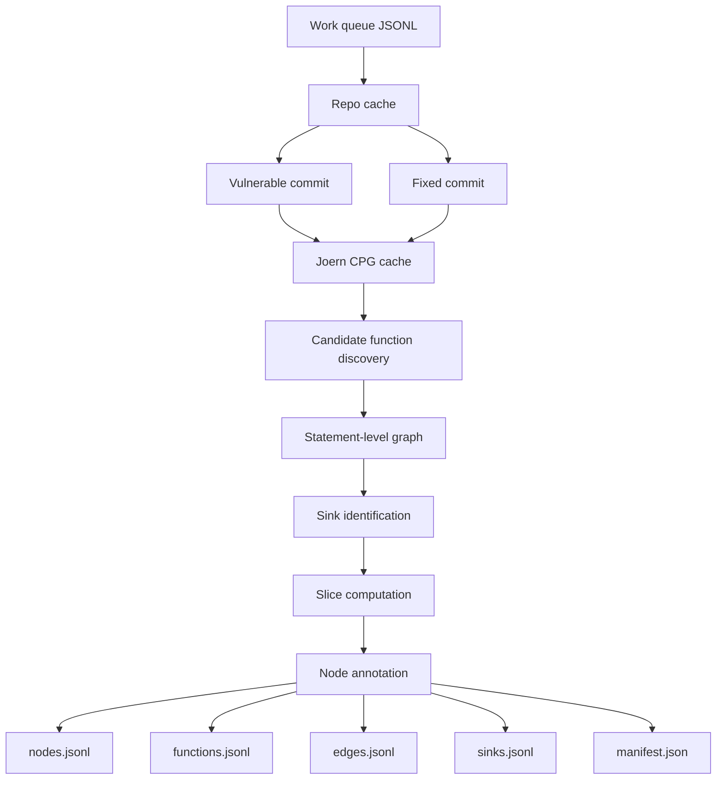
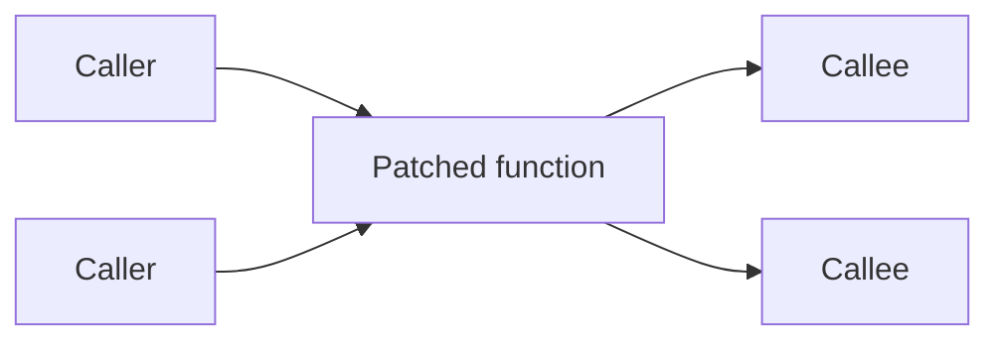
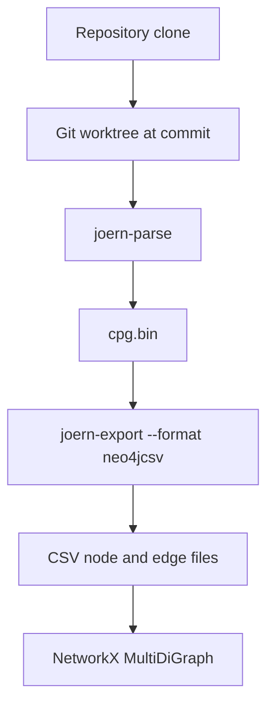
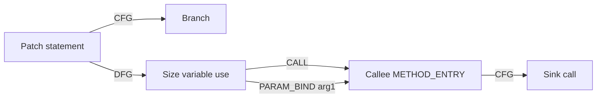
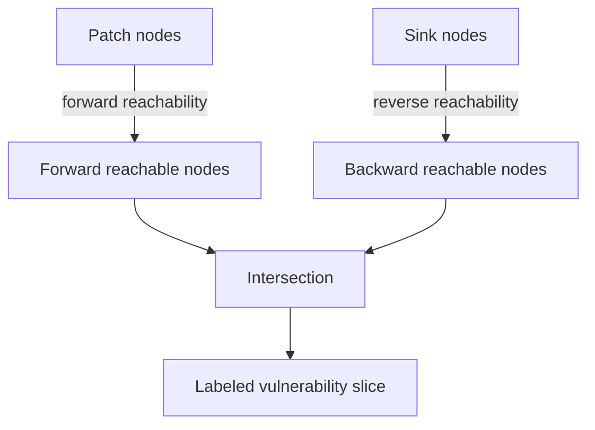

# Node-Level Vulnerability Dataset Project Documentation

## 1. Project Overview

This project builds a node-level vulnerability dataset for training machine
learning models to identify which program statements contribute to a
vulnerability.

The dataset is built from real CVE-fixing commits. For each vulnerability, the
pipeline analyzes both:

- the vulnerable version of the code
- the fixed version of the code

Each dataset record represents one statement-level node in a C program. The
record includes graph structure, code features, patch proximity, sink metadata,
and a binary label indicating whether the statement is vulnerability-relevant.

The central goal is to support models that reason beyond a single changed line.
The pipeline captures multi-function dependencies through control-flow,
data-flow, call, and parameter-binding edges.

## 2. Problem Statement

Traditional vulnerability datasets often label entire files or functions. This
is too coarse for models that need to learn which statements actually contribute
to vulnerable behavior.

This project instead constructs a statement-level graph dataset:

| Level | Meaning |
| --- | --- |
| Patch | A CVE fix represented by vulnerable and fixed commits |
| Function | A patched function plus nearby caller/callee functions |
| Node | One coarse program statement |
| Edge | Program relationship such as CFG, DFG, CALL, or PARAM_BIND |
| Label | Whether the node is inside the computed vulnerability slice |

The output is intended for downstream graph ML workflows, including GNNs and
other models that consume structured program graphs.

## 3. Repository Layout

| Path | Purpose |
| --- | --- |
| `build_dataset.py` | Batch orchestrator. Reads a JSONL work queue and runs the full pipeline. |
| `validate_dataset.py` | Validates generated dataset files for schema, counts, labels, and edge integrity. |
| `test_queue.jsonl` | Small real-CVE work queue used to generate the current dataset. |
| `test_dataset/` | Generated node-level dataset from the current five-CVE run. |
| `pipeline/find_candidates.py` | Step 1: parse patch diff and find candidate functions. |
| `pipeline/build_program_graph.py` | Step 2: build statement-level program graph. |
| `pipeline/sinks.py` | Step 3: identify dangerous sink nodes. |
| `pipeline/slicer.py` | Step 5: compute vulnerability-relevant slice. |
| `pipeline/annotate.py` | Step 7: emit final per-node dataset records. |
| `pipeline/cpg_cache.py` | Shared Joern CPG cache per repository commit. |
| `pipeline/_cpg_loader.py` | Loads Joern `neo4jcsv` exports into NetworkX. |
| `pipeline/schema.md` | Original schema reference for the dataset format. |
| `test_*.py` | Unit and integration tests for individual steps and orchestration. |

## 4. End-to-End Architecture

The project uses Joern to build Code Property Graphs (CPGs), NetworkX to process
graphs in Python, and JSONL files as the final dataset format.



## 5. Input Format

The orchestrator reads a JSONL work queue. Each line describes one CVE patch.

Example from `test_queue.jsonl`:

```json
{
  "patch_id": "curl/CVE-2023-38545",
  "repo_url": "https://github.com/curl/curl",
  "commit_vuln": "09e25b9d94f4106eac8ca3a43b221bdc66f405e4",
  "commit_fix": "fb4415d8aee6c1045be932a34fe6107c2f5ed147",
  "cve": "CVE-2023-38545",
  "cwes": ["CWE-122", "CWE-787", "CWE-119"]
}
```

| Field | Meaning |
| --- | --- |
| `patch_id` | Human-readable dataset identifier. Usually `project/CVE-ID`. |
| `repo_url` | Git repository URL. |
| `commit_vuln` | Vulnerable commit analyzed before the fix. |
| `commit_fix` | Fix commit analyzed after the patch. |
| `cve` | CVE identifier. |
| `cwes` | CWE classes used for sink identification. |
| `extra_sinks` | Optional manual sink overrides as `(file, line)` pairs. |

## 6. Pipeline Steps

The project implements a seven-step design. Some conceptual steps are folded
into neighboring modules in the current implementation.

| Step | Module | Status | What It Does |
| --- | --- | --- | --- |
| 1 | `find_candidates.py` | Implemented | Parses the diff and finds patched functions plus caller/callee neighbors. |
| 2 | `build_program_graph.py` | Implemented | Builds a statement-level graph with CFG, DFG, CALL, and PARAM_BIND edges. |
| 3 | `sinks.py` | Implemented | Marks dangerous APIs as sinks using CWE mappings, patch proximity, and manual overrides. |
| 4 | Folded into Step 3/5 | Implemented conceptually | Sink identification and preparation for slicing. |
| 5 | `slicer.py` | Implemented | Computes the vulnerability slice using graph reachability. |
| 6 | Folded into Step 7 | Implemented conceptually | Patch-aware filtering exposed through `distance_to_patch`. |
| 7 | `annotate.py` | Implemented | Emits final per-node records with features and labels. |

## 7. Step 1: Candidate Function Discovery

`pipeline/find_candidates.py` starts from a vulnerable commit and a fix commit.
It runs `git diff`, parses modified lines, maps those lines to functions, and
expands the candidate set using the call graph.

The candidate set is:

```text
candidate_functions = patch_functions union callers(patch_functions) union callees(patch_functions)
```

By default, the expansion is one hop.



Each candidate function is assigned a role:

| Role | Meaning |
| --- | --- |
| `patch` | Function directly touched by the patch. |
| `caller` | Function that calls a patched function. |
| `callee` | Function called by a patched function. |

### Diff Handling

The pipeline handles separate line sets for the vulnerable and fixed versions:

| Version | Modified Lines Used |
| --- | --- |
| Vulnerable | Removed lines from the patch, plus carefully bounded context for pure-addition fixes. |
| Fixed | Added lines from the patch. |

This matters because a fix that only adds a bounds check may not remove any
vulnerable-side line. The pipeline keeps nearby old-side context so the
vulnerable version can still be analyzed.

## 8. Joern CPG Construction and Caching

`pipeline/cpg_cache.py` builds and caches Joern CPGs per `(repo, commit)` pair.

For each commit, it:

1. Creates a detached git worktree for that commit.
2. Runs `joern-parse` to produce `cpg.bin`.
3. Runs `joern-export` with `--format neo4jcsv`.
4. Stores the result under `~/.cache/vuln_dataset/cpgs`.

The current implementation uses `neo4jcsv` because it is more reliable on large
real-world C projects than GraphSON or GraphML.



## 9. Step 2: Statement-Level Graph Construction

`pipeline/build_program_graph.py` converts raw Joern CPG data into a coarse
statement-level graph.

Joern CPGs contain many low-level nodes: methods, blocks, calls, identifiers,
literals, field identifiers, operators, parameters, and more. The dataset does
not expose every raw CPG node. Instead, it collapses expression-level detail
into statement-level nodes.

### Statement Node Rule

A raw CPG node becomes a statement-level node if it is:

| Rule | Example |
| --- | --- |
| A `METHOD` node | Function entry node. |
| A `CONTROL_STRUCTURE` node | `if`, `for`, `while`, `switch`. |
| A `RETURN` node | `return x;`. |
| A direct AST child of a `BLOCK` node | Assignment, call, declaration, etc. |

Expression nodes such as identifiers, literals, field identifiers, and
parameters are rolled up into the nearest statement.

### Statement Type Normalization

Joern represents operators as `CALL` nodes such as
`<operator>.assignment` or `<operator>.addition`. The pipeline normalizes these
into a smaller statement-type vocabulary.

| Raw Joern Form | Normalized Type |
| --- | --- |
| `<operator>.assignment` | `ASSIGN` |
| `<operator>.addition` | `ARITH` |
| `<operator>.logicalAnd` | `LOGICAL` |
| `<operator>.lessThan` | `COMPARE` |
| `<operator>.fieldAccess` | `FIELD` |
| Real function call | `CALL` |
| `CONTROL_STRUCTURE` with `IF` | `IF` |
| `RETURN` | `RETURN` |
| `LOCAL` | `DECL` |

### Graph Edge Types

The statement-level graph keeps semantic edges that are useful for ML training.

| Edge Type | Source | Meaning |
| --- | --- | --- |
| `CFG` | Joern CFG | Control-flow relationship between statements. |
| `DFG` | Joern `REACHING_DEF` | Data-flow/reaching-definition relationship. |
| `CALL` | Joern call graph | Caller statement to callee function entry. |
| `PARAM_BIND` | Derived by pipeline | Call argument statement to callee entry, one edge per argument index. |

AST edges are used internally during graph construction but are not part of the
final traversal edge set used for slicing.



## 10. Step 3: Sink Identification

`pipeline/sinks.py` marks statements where a vulnerability may manifest. These
are usually dangerous API calls such as `memcpy`, `strcpy`, `malloc`, `system`,
or `memcmp`.

Sink identification combines three signals:

| Signal | Description |
| --- | --- |
| CWE-keyed API matching | Uses the CVE's CWE IDs to select relevant dangerous APIs. |
| Patch proximity | Flags dangerous API calls near patched lines, even if the CWE mapping is incomplete. |
| Manual overrides | Allows explicit `(file, line)` sink annotations through `extra_sinks`. |

Example CWE mapping:

| CWE | Vulnerability Family | Example APIs |
| --- | --- | --- |
| `CWE-119` | Bounds restriction / memory safety | `memcpy`, `strcpy`, `memmove`, `sprintf` |
| `CWE-122` | Heap overflow | `malloc`, `calloc`, `realloc`, `memcpy` |
| `CWE-125` | Out-of-bounds read | `memcpy`, `memmove`, `memcmp`, `strcmp` |
| `CWE-787` | Out-of-bounds write | `memcpy`, `memmove`, `strcpy`, `snprintf` |
| `CWE-78` | Command injection | `system`, `popen`, `execve` |

If no sink is found, the slicer falls back to using patch nodes as implicit
sinks. This keeps logic bugs and non-API vulnerabilities usable.

## 11. Step 5: Slice Computation

`pipeline/slicer.py` computes which nodes are vulnerability-relevant.

The core idea is:

```text
slice = forward_reachable_from_patch intersection backward_reachable_from_sinks
```

Traversal uses:

```text
CFG union DFG union CALL union PARAM_BIND
```

AST is intentionally excluded because AST structure does not by itself imply
control, data, or interprocedural dependence.



### Slice Definition

For a node `n`:

```text
in_slice(n) = n is reachable forward from a patch node
              AND
              n can reach a sink node backward
```

This captures nodes that lie in the dependency region between the patch and the
vulnerability manifestation.

### Fallback Behavior

| Case | Behavior |
| --- | --- |
| No patch nodes | Slice is empty and the sample is flagged. |
| No sink nodes | Patch nodes become implicit sinks. |
| Empty intersection | Uses the union of patch and sink anchors as a minimal fallback. |

The default traversal budget is 10 hops forward and 10 hops backward.

## 12. Step 7: Node Annotation

`pipeline/annotate.py` emits the final per-node records.

Each record includes:

| Feature Group | Fields |
| --- | --- |
| Identity | `id`, `patch_id`, `version`, `commit`, `function`, `function_full`, `file` |
| Function role | `role`, `modified_lines` |
| Statement | `statement`, `type`, `line`, `called_function` |
| Structure | `depth`, `depth_cfg`, `depth_ast`, `in_loop`, `in_branch` |
| Variables | `variables_used`, `variables_defined` |
| Sink metadata | `is_sink`, `sink_reason` |
| Patch proximity | `is_patch_related`, `distance_to_patch` |
| Cross-function metadata | `is_cross_function` |
| Graph neighbors | `CFG_successors`, `CFG_predecessors`, `DFG_successors`, `DFG_predecessors`, `CALL_edges`, `CALL_predecessors`, `PARAM_BIND_edges`, `PARAM_BIND_predecessors` |
| Label | `in_slice`, `label` |

The binary label is:

```text
label = 1 if in_slice else 0
```

## 13. Output Dataset Files

The generated dataset is stored as JSONL files.

| File | Contains |
| --- | --- |
| `nodes.jsonl` | Main training records. One row per statement-level node. |
| `functions.jsonl` | Candidate function metadata per patch/version. |
| `edges.jsonl` | Canonical graph edges between node IDs. |
| `sinks.jsonl` | Sink node records and sink reasons. |
| `skipped.jsonl` | Failed/skipped patch entries with stage and reason. |
| `manifest.json` | Run configuration, totals, timing, and queue path. |
| `samples/*.json` | Optional debug sample dumps when `--debug-samples` is enabled. |

### Current Dataset Output

The current generated dataset is in:

```text
test_dataset/
```

It contains:

| File | Count / Size |
| --- | ---: |
| `nodes.jsonl` | 11,000 records |
| `functions.jsonl` | 274 records |
| `edges.jsonl` | 166,177 records |
| `sinks.jsonl` | 46 records |
| `skipped.jsonl` | 0 records |
| `samples/` | 10 debug sample files |

The dataset covers five CVEs across vulnerable and fixed versions:

| Project | CVE | Versions |
| --- | --- | --- |
| curl | CVE-2023-38545 | vulnerable + fixed |
| zlib | CVE-2022-37434 | vulnerable + fixed |
| tcpdump | CVE-2017-16808 | vulnerable + fixed |
| tcpdump | CVE-2018-14468 | vulnerable + fixed |
| libpcap | CVE-2019-15161 | vulnerable + fixed |

### Validation Output and Where to Insert It

The validation output belongs immediately after the "Current Dataset Output"
section in reports, papers, or README-style documentation. It proves that the
generated files are present, structurally complete, and internally consistent.

Command:

```bash
python3 validate_dataset.py --out test_dataset
```

The validation output contains:

| Section | What It Means |
| --- | --- |
| File presence | Confirms all expected output files exist. |
| Record counts | Counts rows in `nodes`, `functions`, `edges`, `sinks`, and `skipped`. |
| Manifest totals | Shows the run configuration and totals written by the orchestrator. |
| Label distribution | Reports how many nodes have `label=1`. |
| Node type distribution | Shows most common statement types. |
| Per-sample coverage | Shows node counts for each `(patch_id, version)`. |
| Edge integrity | Checks that edge endpoints resolve to known node IDs. |
| Sink summary | Lists sink counts and top sink reasons. |
| Red flags | Reports structural problems if any are found. |

Current validation summary:

| Metric | Value |
| --- | ---: |
| Nodes checked | 11,000 |
| Positive labels | 3,764 |
| Positive rate | 34.22% |
| Edge integrity sample | 5,000 / 5,001 resolved |
| Sinks | 46 |
| Top sink reason | `cwe_api:memcpy` |
| Skipped rows | 0 |
| Validator result | No red flags |

Important note: `manifest.json` reflects the most recent orchestrator run, while
the dataset directory can contain accumulated output from resumed/incremental
runs. The actual files currently contain 11,000 node records across five CVEs.

## 14. Real-World Results So Far

| Project | Approx. LoC | CVE | CWE | Slice Characteristic |
| --- | ---: | --- | --- | --- |
| curl | ~100k | CVE-2023-38545 | 122 | Mostly patch-function, heap-overflow style vulnerability. |
| zlib | ~15k | CVE-2022-37434 | 125 | Patch-function dominant and locally contained. |
| tcpdump | ~70k | CVE-2017-16808 | 125 | Strong multi-function signal; many labels in callees. |
| tcpdump | ~70k | CVE-2018-14468 | 125 | No-sink fallback case, useful for logic-style bugs. |
| libpcap | ~30k | CVE-2019-15161 | 125 | Mixed patch and callee relevance. |

Aggregate output:

| Metric | Value |
| --- | ---: |
| CVEs | 5 |
| Samples | 10 |
| Node records | 11,000 |
| Edge records | 166,177 |
| Sink records | 46 |
| Skipped entries | 0 |
| Runtime | About 4 minutes |

## 15. Orchestrator Behavior

The top-level `build_dataset.py` scales the pipeline from one patch to many.

It provides:

| Capability | Description |
| --- | --- |
| Shared repository cache | Clones each repository once and reuses it across CVEs. |
| CPG cache | Reuses Joern CPGs per `(repo, commit)`. |
| Failure isolation | One bad patch is written to `skipped.jsonl` instead of crashing the run. |
| Resume support | Already-processed patch IDs are skipped on restart. |
| Streaming output | JSONL files are appended incrementally, keeping memory bounded. |
| Manifest | Records totals, runtime, queue path, and run configuration. |

Example command:

```bash
python3 build_dataset.py \
  --work-queue test_queue.jsonl \
  --out test_dataset \
  --debug-samples
```

Validation command:

```bash
python3 validate_dataset.py --out test_dataset
```

## 16. Testing

The repository includes unit and integration tests for the core pipeline.

| Test File | Coverage |
| --- | --- |
| `test_diff_parser.py` | Diff parsing and modified-line extraction. |
| `test_step2_unit.py` | Statement graph construction. |
| `test_step3_unit.py` | Sink identification. |
| `test_step5_unit.py` | Slice computation. |
| `test_step7_unit.py` | Node annotation. |
| `test_orchestrator.py` | Offline integration test for the batch orchestrator. |
| `smoke_test_step1.py` | Smoke testing candidate discovery on a synthetic C project. |

The test suite covers the most important behavior:

- diff parsing
- pure-addition patch handling
- statement classification
- sink matching
- fallback slicing behavior
- canonical node IDs
- edge endpoint rewriting
- orchestrator resume and failure isolation

## 17. Bugs Found and Fixed

During development, several real-world issues were found and hardened against.

| Issue | Impact | Fix |
| --- | --- | --- |
| GraphSON nested property format | Initial reader expected simpler GraphSON values. | Moved final pipeline to `neo4jcsv`; earlier parsing lessons informed loader robustness. |
| Joern synthetic `<global>` methods | File-wide fake functions could win line-containment lookups. | Filtered synthetic global/include methods. |
| Bug-introducing commit vs fix parent confusion | Diff could include years of unrelated history. | Use vulnerable state adjacent to fix commit when constructing queue entries. |
| Non-UTF-8 diff bytes | `git diff` decoding could fail. | Use `errors="replace"`. |
| Hunk context spilling into adjacent functions | Pure-addition fixes could attribute context to the wrong function. | Keep only context lines within a small window of actual additions. |
| Method map unpacking bug | BFS could start from a function-name string instead of node ID. | Corrected key/value handling. |
| GraphSON export crash | Joern failed on large real CPGs. | Switched to `neo4jcsv`. |
| GraphML JVM entity-size limit | Large XML export crashed during Joern's internal formatting. | Avoided GraphML and used `neo4jcsv`. |
| Stale git worktree registry | Removing CPG cache left dangling worktree metadata. | Run `git worktree prune` before creating new worktrees. |
| PARAM_BIND deduplication | Multiple call arguments collapsed into one edge. | Include argument index in `PARAM_BIND` edge key. |

## 18. Current State

The project currently has:

- a validated working pipeline
- a generated five-CVE node-level dataset
- JSONL outputs suitable for ML preprocessing
- multi-function graph construction
- patch-aware slicing
- sink-aware labeling
- unit and integration tests
- a pushed git checkpoint containing the working implementation

This is a working prototype dataset generator. It has been tested on real CVEs
and produces structurally valid output.

## 19. What's Left

Two things remain, in order of recommendation.

### 1. CVEfixes Ingestor

Build a small ingestor that turns the CVEfixes SQLite dump into a work queue.

The output should be a JSONL file with the same schema as `test_queue.jsonl`:

```json
{
  "patch_id": "project/CVE-ID",
  "repo_url": "https://github.com/owner/repo",
  "commit_vuln": "fix_parent_or_vulnerable_commit",
  "commit_fix": "fix_commit",
  "cve": "CVE-ID",
  "cwes": ["CWE-XXX"]
}
```

After this exists, the project can scale from five CVEs to hundreds or
thousands by changing only the work queue file.

Expected command shape:

```bash
python3 ingest_cvefixes.py \
  --db CVEfixes.db \
  --out queue_500.jsonl \
  --limit 500
```

Estimated size: about 80 lines of code.

### 2. Full-Scale Run

Once the ingestor produces a 500-CVE queue, run the orchestrator overnight.

Expected command shape:

```bash
python3 build_dataset.py \
  --work-queue queue_500.jsonl \
  --out dataset_500 \
  --debug-samples
```

Then validate:

```bash
python3 validate_dataset.py --out dataset_500
```

The expected result is a larger research dataset with hundreds or thousands of
real CVE-derived vulnerable/fixed samples.

## 20. Optional Future Polish

The current pipeline is usable. The following improvements are optional:

| Improvement | Why It Helps |
| --- | --- |
| Tune `max_hops_slice` | Controls label density and slice size. |
| Add graded labels | Supports tiers such as `PATCH_CORE`, `TAINT_RELEVANT`, `SEMANTIC_SEED`, and `NEGATIVE`. |
| Add PyTorch/PyG loader | Makes the dataset easier to use for GNN training. |
| Add richer source/sink modeling | Improves vulnerability-specific precision. |
| Add parallel orchestration | Speeds up large-scale runs across many CVEs. |
| Add dataset cards | Documents provenance, limitations, and intended use for research release. |

## 21. Recommended Next Command Sequence

After adding the CVEfixes ingestor:

```bash
python3 ingest_cvefixes.py --db CVEfixes.db --out queue_500.jsonl --limit 500
python3 build_dataset.py --work-queue queue_500.jsonl --out dataset_500 --debug-samples
python3 validate_dataset.py --out dataset_500
```

This sequence turns the current validated prototype into a full-scale research
dataset generation run.
